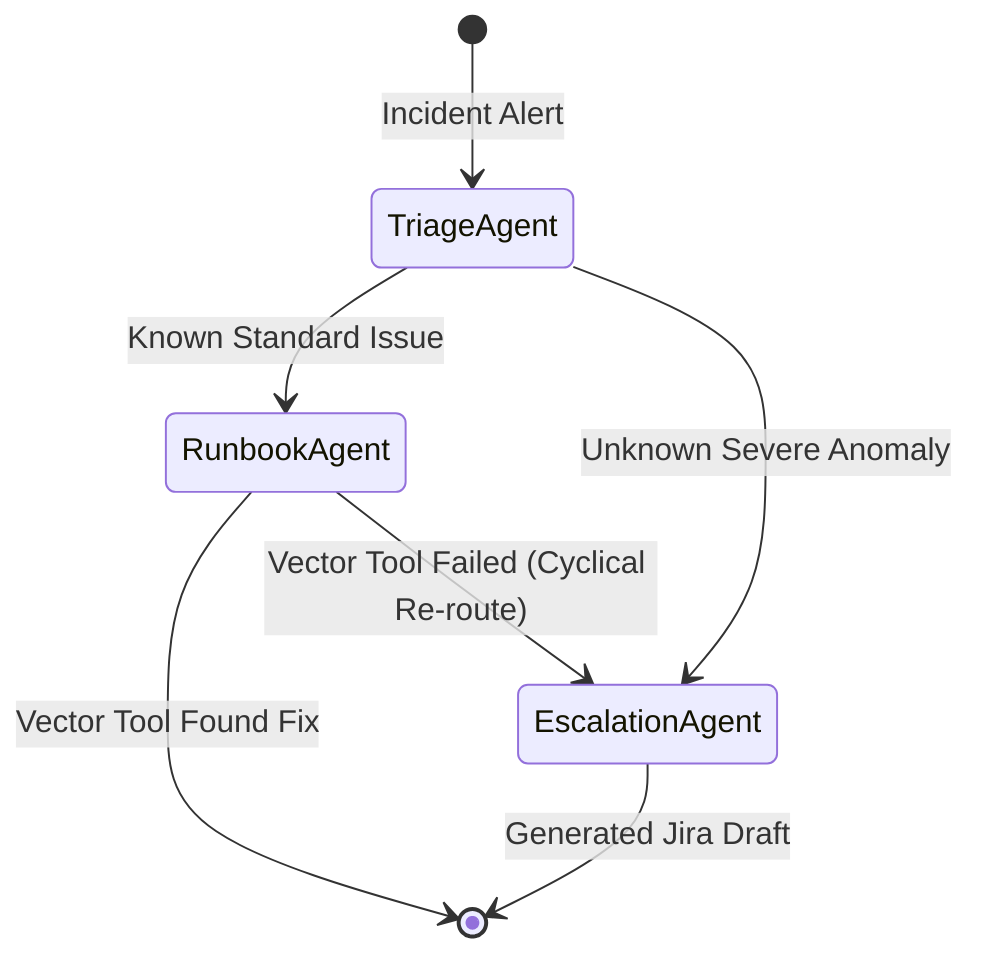

# Project 4: The Incident Responder (LangGraph)

This project demonstrates advanced **Multi-Agent Systems (MAS)** orchestration. Instead of using a singular massive Large Language Model to guess answers, we employ an explicit State Graph populated by multiple segmented AI Agents. Each agent has a distinct specialization, specific tools, and the capability to asynchronously route workloads based on autonomous decision-making.

## Architectural Differentiator

### Why LangGraph vs AWS Strands / Step Functions?
AWS provides excellent native orchestration pipelines (notably **Amazon Bedrock Multi-Agent Strands** and **AWS Step Functions**). However, for advanced AI architecture, we purposefully chose **LangGraph** in a fully isolated Python state container. 

Here is exactly why that distinction proves Principal-level reasoning:
1. **Linear DAGs vs Cyclical Flow:** AWS Step Functions enforce rigid, linear Directed Acyclic Graphs (DAGs). This is structurally incompatible with true AI reasoning where an agent might need to try a tool, fail, route the state *backwards* to a previous agent for debugging context, and try again infinitely. LangGraph natively supports dynamic cyclical states computationally.
## The State Machine Architecture (Mermaid)
By separating the agents into a strictly typed StateGraph, we visually decoupled their domains:



## The Engineering Flow
1. **The Triage Agent:** The entry-point API. It receives raw telemetry text. Through an internal heuristic prompt, it analyzes the incident constraint. If it's standard, it mathematically routes to Runbooks. If it's a catastrophic anomaly, it skips all steps and routes directly to Escalation.
2. **The Runbook Agent:** Mocks an internal corporate S3/Vector Database search tool. *Autonomous Action*: If the tool succeeds, it suppresses the incident and ends the process. If the tool yields no results, it seamlessly intercepts the failure state and autonomously re-routes the workflow back to Escalation.
3. **The Escalation Agent:** Intercepts critical unresolved states and executes a `create_jira_ticket` tool, automatically generating precise human intervention tickets containing context dynamically aggregated by the previous agents.

## Execution Simulation

Install the required LangGraph orchestrator libraries into your virtual environment:
```bash
pip install -r projects/04-incident-responder/requirements.txt
```

Launch the simulation payload:
```bash
./.venv/bin/python projects/04-incident-responder/main.py
```
