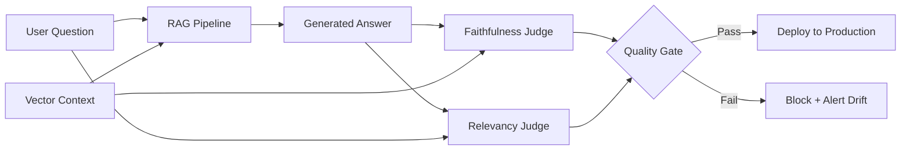

# Project 5: The "Drift" Evaluator (MLOps)

This project solves the critical "Black Box" problem in production Generative AI systems. Without programmatic evaluation, a RAG pipeline might silently hallucinate confident lies, and no human would ever catch it until an end-user reports incorrect data. This evaluator creates a quantifiable, automated feedback loop.

## Architectural Decision: Native Implementation vs. RAGAS SDK

Industry-standard tools like the `ragas` Python package provide convenient wrappers for RAG evaluation. However, we deliberately chose to **build the evaluation engine from scratch** using native `boto3` and Amazon Bedrock.

Why:
1. **Framework Independence:** The `ragas` SDK introduces heavy transitive dependencies (LangChain, OpenAI client libraries, etc.) and abstracts away the actual grading logic. By building natively, we prove deep comprehension of how Faithfulness and Relevancy scoring actually work mathematically.
2. **Cost Control:** We explicitly select Claude 3 Haiku as the Judge model. Haiku processes evaluations at a fraction of the cost of Sonnet/Opus while maintaining sufficient analytical rigor for binary grading tasks.
3. **CI/CD Quality Gate Integration:** By enforcing strict JSON output from the Judge, we can programmatically parse float scores and integrate them directly into automated pipelines (e.g., "If Faithfulness < 0.8, block the deployment").

## The RAGAS Metrics (Implemented Natively)

### Faithfulness (Hallucination Detection)
Measures whether every claim in the model's generated answer is strictly derivable from the provided source context. A low Faithfulness score indicates the model fabricated information not present in the vector database retrieval.

### Answer Relevancy
Measures whether the generated answer directly and completely addresses the user's original question. A low Relevancy score indicates the model went on tangents or avoided the question entirely.

## The State Machine Architecture (Mermaid)



## Execution

Run the evaluation pipeline locally:
```bash
./.venv/bin/python projects/05-drift-evaluator/evaluator.py
```

The pipeline fires three synthetic RAG traces through the Judge:
1. **Perfect Output** - Expected: High Faithfulness, High Relevancy (PASS)
2. **Hallucinated Output** - Expected: Low Faithfulness (FAIL - Drift Detected)
3. **Evasive Output** - Expected: Low Relevancy (FAIL - Drift Detected)
